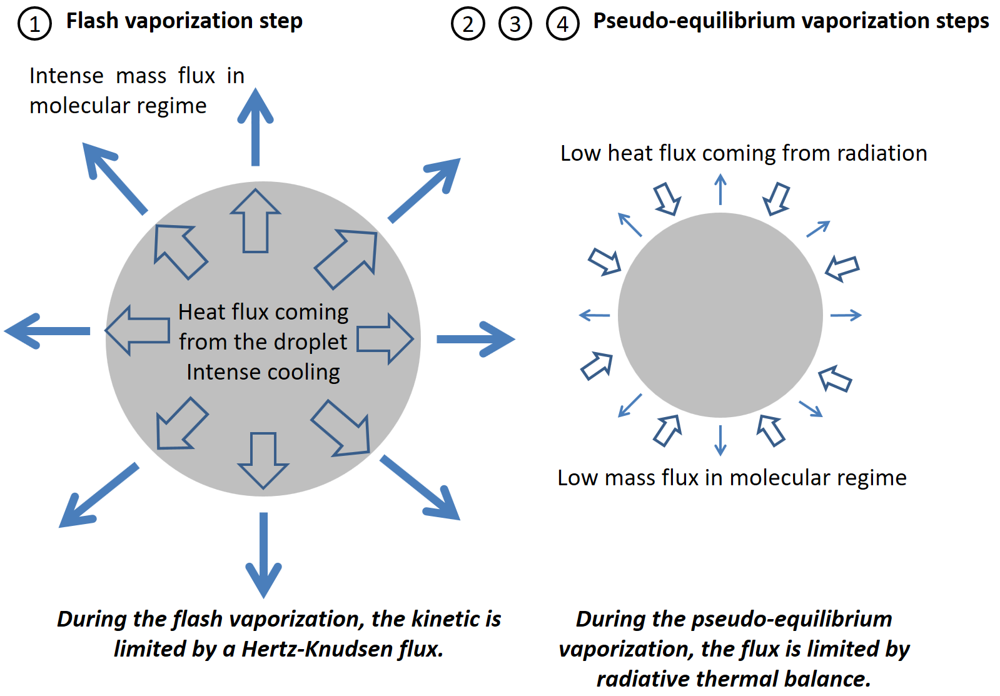

## Numerical modeling of the droplet vaporization for design and operation of liquid pulsed CVD

**Supporting data for paper https://doi.org/10.1002/cvde.201507191**

The repo contains the Matlab codes and the theory that explains what happens when you send a droplet of a liquid in vaccum. This leading question, surprisingly, had no answer until I decided to tackle the set of coupled non linear differential equations equations solving the problem. The output of the codes is a vaporization time that helps to size the reactors used in Pressure Pulsed MOCVD process. The vaporization is made in two steps: a flash vaporization where all the sensible heat of the liquid is drained to sustain boiling. The mass transport in this regime is limited by Hertz-Knudsen flux (other said, the maximum escape velocity of the atoms from a finite surface). After sufficient cooling down, the droplet approches a radiative thermal equilibrium with its environment and the vaporization becomes limited by the radiative thermal flux that can reach it (we are in vacuum so no convective flux). In this state, the droplet behaves more or less as a comet in space and can survive for quite a long time, more or less frozen (not billions of years but seconds, which is yet very detrimental for the process and the reaction rate uniformity).

## Some scheme to explain what happens

The set of non linear differential equations can be solved with your prefered numerical method but Runge-Kutta derived ones do the job with just some limited instabilities at the transition between the two regimes. The main parameter to explain the vaporization time is (of course) the ambient temperature, knowing that the limited step is the pseudo-equilibrium vaporization. This was more or less empirically known by people using Direct Liquid Injection systems in MOCVD.

## (Not) funfact

The initial paper was published with some unit errors (kCal and kJ, the classical one) that change a bit the paper conclusions so the paper comes with an Erratum explaining this. The Journal of CVD in which the paper was published was closed after this issue for reorganization and became the more coveted Advanced Materials.

